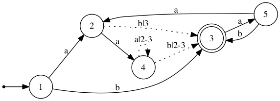

regex-deriv
===========

A regular expression library suite based on Brozowski's derivative implemented in Haskell.

The library features 
- Derivative operation of regular expression
- An efficient regular expression parsing and matching algorithm (faithfully) implementing POSIX matching policy.
- An ambiguity regular expression diagnostic tool

installation
============
```bash
$ cabal configure && cabal build && cabal install
```
matching 
===========
```haskell
module Main where


import Text.Regex.Deriv.ByteString

import System.Environment
import Data.Maybe
import qualified Data.ByteString.Char8 as S


parse compiled s = case regexec compiled s of 
                     (Right (Just (_,_,_,l))) -> Just l
                     _ ->Nothing


main :: IO ()
main = do 
  { [ p, x ] <- getArgs
  ; let pat = S.pack p
        compiled = case compile defaultCompOpt defaultExecOpt pat of
                   Left _  ->error " compilation failed . "
                   Right r ->r
  ; ls <-  S.readFile x
  ; let input = if S.null ls  
                then S.empty 
                else head $ S.lines ls
        result = parse compiled input
  ; putStrLn (show result)
  }
```
ambiguity check
=============
Note that ^r$ is desugar to \epsilon r \epsilon during parsing

```haskell

$ ghci

Prelude> import Text.Regex.Deriv.Diagnosis.Ambiguity
Prelude Text.Regex.Deriv.Diagnosis.Ambiguity> diagnose "^((aa*)|(ba)|(aba))*b$"
Right ["abab","abab"]
Prelude Text.Regex.Deriv.Diagnosis.Ambiguity> diagnoseU "^((aa*)|(ba)|(aba))*b$"
Right [AltU 0 (Pair (AltU 0 EmptyU,Pair (List [AltU 2 (AltU 0 (AltU 0 (Pair (Pair (Letter 'a',Letter 'b'),Letter 'a'))))],Pair (AltU 0 (Letter 'b'),AltU 0 EmptyU)))),AltU 0 (Pair (AltU 0 EmptyU,Pair (List [AltU 0 (AltU 0 (AltU 0 (Pair (Letter 'a',List [])))),AltU 1 (AltU 0 (AltU 0 (Pair (Letter 'b',Letter 'a'))))],Pair (AltU 0 (Letter 'b'),AltU 0 EmptyU))))] 
Prelude Text.Regex.Deriv.Diagnosis.Ambiguity> re2dot "^((aa*)|(ba)|(aba))*b$" "/tmp/out.dot"
Prelude Text.Regex.Deriv.Diagnosis.Ambiguity> :q
Leaving GHCi.

$ dot -Tpng /tmp/out.dot  > out.png
```

